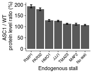
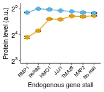

Fluorescence of PGK1 WT reporters with endogenous stall inserts and in WT and ASC1Δ strains
================
rasi
17 July, 2019

-   [Import libraries and analysis-specific parameters](#import-libraries-and-analysis-specific-parameters)
-   [Read data](#read-data)
-   [Read annotations](#read-annotations)
-   [Rename and calculate average values of fluorescence channels in each well](#rename-and-calculate-average-values-of-fluorescence-channels-in-each-well)
-   [Calculate mean and standard error over replicates](#calculate-mean-and-standard-error-over-replicates)
-   [Plot and tabulate background subtracted ratio of YFP/RFP between ASC1KO and WT strains (used for calculating P-value)](#plot-and-tabulate-background-subtracted-ratio-of-yfprfp-between-asc1ko-and-wt-strains-used-for-calculating-p-value)
-   [Plot and tabulate background subtracted YFP/RFP ratio for endogenous stalls](#plot-and-tabulate-background-subtracted-yfprfp-ratio-for-endogenous-stalls)
-   [Display t.test P-value for difference in YFP/RFP ratio between WT and ASC1 strains for each stall](#display-t.test-p-value-for-difference-in-yfprfp-ratio-between-wt-and-asc1-strains-for-each-stall)

Import libraries and analysis-specific parameters
=================================================

``` r
# standard analysis and plotting functions, includes dplyr, ggplot2 
library(tidyverse)
# loads lab default ggplot2 theme and provides color-blind friendly palette
library(rasilabRtemplates)
# standard error
library(plotrix)
# to tidy up statistical test results
library(broom)

# this folder contains the data and annotations
fcs_file_folder <- "../../data/flow/endogenous_gene_stall/"

# These are the PAR32 plasmid 1 that had a deletion of an AAG
bad_wells <- tibble(strain = c("schp1499", "schp1491"))
```

Read data
=========

``` r
flowdata  <- read_tsv(paste0(fcs_file_folder, '/data.tsv.xz')) %>% 
  print()
```

    ## # A tibble: 840,000 x 7
    ##    plate well   FSC.A  SSC.A FITC.A PE.Texas.Red.A  Time
    ##    <int> <chr>  <int>  <int>  <int>          <int> <dbl>
    ##  1     1 B2    114333  89534    140            126  3.03
    ##  2     1 B2     40328  18838     45             14  3.04
    ##  3     1 B2     77999  56223     59             53  3.04
    ##  4     1 B2    128758  55886     79             29  3.04
    ##  5     1 B2    113005  47530     43             17  3.05
    ##  6     1 B2     54542    -47    -67              1  3.06
    ##  7     1 B2     40364  20969     -5             45  3.12
    ##  8     1 B2     25567  15818     15             39  3.14
    ##  9     1 B2     73250  33755     83              0  3.16
    ## 10     1 B2     22494  12836     30              1  3.17
    ## # ... with 839,990 more rows

Read annotations
================

``` r
annotations  <- read_tsv(paste0(fcs_file_folder, '/annotations.tsv')) %>% 
  print()
```

    ## # A tibble: 84 x 7
    ##    plate well  strain   gene    stall kogene replicate
    ##    <int> <chr> <chr>    <chr>   <chr> <chr>      <int>
    ##  1     1 B2    by4741   <NA>    <NA>  <NA>           1
    ##  2     1 B3    schp15   <NA>    <NA>  <NA>           1
    ##  3     1 B4    schp19   maxhis3 6xcgg <NA>           1
    ##  4     1 B5    schp20   maxhis3 6xaga <NA>           1
    ##  5     1 B6    schp498  <NA>    <NA>  <NA>           1
    ##  6     1 B7    schp1490 PGK1    MAP2  <NA>           1
    ##  7     1 B8    schp1491 PGK1    PAR32 <NA>           1
    ##  8     1 B9    schp1492 PGK1    PAR32 <NA>           1
    ##  9     1 B10   schp1493 PGK1    HMO1  <NA>           1
    ## 10     1 B11   schp1494 PGK1    RMP1  <NA>           1
    ## # ... with 74 more rows

Rename and calculate average values of fluorescence channels in each well
=========================================================================

``` r
by_file <- flowdata  %>% 
  # group by each plate and well
  group_by(plate, well) %>% 
  select(FITC.A, PE.Texas.Red.A) %>% 
  # calculate mean
  summarise_all(mean) %>% 
  # rename
  rename('yfp' = FITC.A, 'rfp' = PE.Texas.Red.A) %>% 
  # join annotations
  left_join(annotations, by = c('plate', 'well')) %>% 
  print()
```

    ## # A tibble: 84 x 9
    ## # Groups:   plate [?]
    ##    plate well     yfp    rfp strain   gene    stall kogene replicate
    ##    <int> <chr>  <dbl>  <dbl> <chr>    <chr>   <chr> <chr>      <int>
    ##  1     1 B10   5036.  8073.  schp1493 PGK1    HMO1  <NA>           1
    ##  2     1 B11   2833.  7597.  schp1494 PGK1    RMP1  <NA>           1
    ##  3     1 B2      14.4   17.8 by4741   <NA>    <NA>  <NA>           1
    ##  4     1 B3      46.0 7300.  schp15   <NA>    <NA>  <NA>           1
    ##  5     1 B4     224.  6434.  schp19   maxhis3 6xcgg <NA>           1
    ##  6     1 B5    2983.  7312.  schp20   maxhis3 6xaga <NA>           1
    ##  7     1 B6     110.  8622.  schp498  <NA>    <NA>  <NA>           1
    ##  8     1 B7    4924.  7295.  schp1490 PGK1    MAP2  <NA>           1
    ##  9     1 B8    4813.  7562.  schp1491 PGK1    PAR32 <NA>           1
    ## 10     1 B9    3513.  7957.  schp1492 PGK1    PAR32 <NA>           1
    ## # ... with 74 more rows

Calculate mean and standard error over replicates
=================================================

``` r
avg_data  <- by_file %>% 
  anti_join(bad_wells) %>%
  # strain is used to get replicates
  group_by(strain) %>% 
  # calculate mean and std.err
  mutate(mean_yfp = mean(yfp), 
         mean_rfp = mean(rfp)) %>% 
  ungroup() %>% 
  mutate(yfp = yfp - mean_yfp[strain == "schp15" & replicate == 1], 
         rfp = rfp - mean_rfp[strain == "by4741" & replicate == 1]) %>% 
  mutate(yfp_rfp_ratio = yfp / rfp) %>% 
  # calculate mean and standard error
  group_by(strain) %>% 
  mutate(mean_yfp = mean(yfp), 
         mean_rfp = mean(rfp), 
         mean_ratio = mean(yfp_rfp_ratio), 
         se_yfp = std.error(yfp), 
         se_rfp = std.error(rfp),
         se_ratio = std.error(yfp_rfp_ratio),
         n = n()) %>% 
  ungroup()

normalization <- avg_data %>% 
  filter(strain == "schp19")
```

Plot and tabulate background subtracted ratio of YFP/RFP between ASC1KO and WT strains (used for calculating P-value)
=====================================================================================================================

``` r
plot_data <- avg_data %>% 
  # mutate(plasmid_replicate = as.factor(plasmid_replicate)) %>% 
  filter(gene == "PGK1") %>% 
  group_by(strain) %>% 
  slice(1) %>% 
  ungroup() %>% 
  group_by(stall) %>% 
  mutate(mean_asc1_wt_ratio = mean_ratio / mean_ratio[is.na(kogene)] * 100) %>% 
  mutate(se_asc1_wt_ratio = (se_ratio / mean_ratio + 
                               se_ratio[is.na(kogene)] / mean_ratio[is.na(kogene)]) * 
           mean_asc1_wt_ratio) %>% 
  ungroup() %>% 
  mutate(stall = if_else(is.na(stall), "No stall", as.character(stall))) %>% 
  mutate(stall = fct_reorder(stall, -mean_asc1_wt_ratio)) %>% 
  filter(!is.na(kogene)) %>% 
  print()
```

    ## # A tibble: 7 x 19
    ##   plate well    yfp   rfp strain gene  stall kogene replicate mean_yfp
    ##   <int> <chr> <dbl> <dbl> <chr>  <chr> <fct> <chr>      <int>    <dbl>
    ## 1     1 C5    6104. 8340. schp1… PGK1  MAP2  ASC1           1    5927.
    ## 2     1 C7    6674. 8112. schp1… PGK1  PAR32 ASC1           1    6567.
    ## 3     1 C8    6622. 8512. schp1… PGK1  HMO1  ASC1           1    6444.
    ## 4     1 C9    6293. 8691. schp1… PGK1  RMP1  ASC1           1    5933.
    ## 5     1 C10   6386. 8750. schp1… PGK1  TMA23 ASC1           1    6310.
    ## 6     1 C11   6294. 8380. schp1… PGK1  JJJ1  ASC1           1    6159.
    ## 7     1 D2    6340. 8656. schp1… PGK1  No s… ASC1           1    6093.
    ## # ... with 9 more variables: mean_rfp <dbl>, yfp_rfp_ratio <dbl>,
    ## #   mean_ratio <dbl>, se_yfp <dbl>, se_rfp <dbl>, se_ratio <dbl>, n <int>,
    ## #   mean_asc1_wt_ratio <dbl>, se_asc1_wt_ratio <dbl>

``` r
plot_data %>%
  ggplot(aes(x = stall, y = mean_asc1_wt_ratio,
             ymin = mean_asc1_wt_ratio - se_asc1_wt_ratio,
             ymax = mean_asc1_wt_ratio + se_asc1_wt_ratio,
             group = NA)) +
  # geom_point(size = 1.5) +
  geom_col() +
  geom_errorbar(width = 0.25) +
  labs(y = 'ASC1 / WT \n protein level ratio (%)',
       x = 'Endogenous stall') +
  scale_color_manual(values = cbPalette) +
  scale_y_continuous(limits = c(0, NA)) +
  theme(legend.title = element_text(size = 8),
        axis.text.x = element_text(angle = 45, hjust = 1, size = 6)
        )
```



Plot and tabulate background subtracted YFP/RFP ratio for endogenous stalls
===========================================================================

``` r
plot_data <- avg_data %>% 
  mutate(mean_ratio = mean_ratio / normalization[[1, "mean_ratio"]]) %>% 
  mutate(se_ratio = se_ratio / normalization[[1, "mean_ratio"]]) %>% 
  filter(gene == "PGK1") %>% 
  group_by(strain) %>% 
  slice(1) %>% 
  ungroup() %>% 
  group_by(stall) %>% 
  mutate(mean_asc1_wt_ratio = mean_ratio / mean_ratio[is.na(kogene)] * 100) %>% 
  ungroup() %>% 
  mutate(kogene = fct_rev(if_else(is.na(kogene), "WT", as.character(kogene)))) %>% 
  mutate(stall = if_else(is.na(stall), "No stall", as.character(stall))) %>% 
  mutate(stall = fct_reorder(stall, - mean_asc1_wt_ratio)) %>% 
  print()
```

    ## # A tibble: 14 x 18
    ##    plate well    yfp   rfp strain gene  stall kogene replicate mean_yfp
    ##    <int> <chr> <dbl> <dbl> <chr>  <chr> <fct> <fct>      <int>    <dbl>
    ##  1     1 B7    4878. 7282. schp1… PGK1  MAP2  WT             1    4761.
    ##  2     1 B9    3468. 7944. schp1… PGK1  PAR32 WT             1    3297.
    ##  3     1 B10   4990. 8060. schp1… PGK1  HMO1  WT             1    4681.
    ##  4     1 B11   2788. 7584. schp1… PGK1  RMP1  WT             1    2695.
    ##  5     1 C2    4745. 7263. schp1… PGK1  TMA23 WT             1    4875.
    ##  6     1 C3    4660. 7604. schp1… PGK1  JJJ1  WT             1    4650.
    ##  7     1 C4    5089. 7511. schp1… PGK1  No s… WT             1    5090.
    ##  8     1 C5    6104. 8340. schp1… PGK1  MAP2  ASC1           1    5927.
    ##  9     1 C7    6674. 8112. schp1… PGK1  PAR32 ASC1           1    6567.
    ## 10     1 C8    6622. 8512. schp1… PGK1  HMO1  ASC1           1    6444.
    ## 11     1 C9    6293. 8691. schp1… PGK1  RMP1  ASC1           1    5933.
    ## 12     1 C10   6386. 8750. schp1… PGK1  TMA23 ASC1           1    6310.
    ## 13     1 C11   6294. 8380. schp1… PGK1  JJJ1  ASC1           1    6159.
    ## 14     1 D2    6340. 8656. schp1… PGK1  No s… ASC1           1    6093.
    ## # ... with 8 more variables: mean_rfp <dbl>, yfp_rfp_ratio <dbl>,
    ## #   mean_ratio <dbl>, se_yfp <dbl>, se_rfp <dbl>, se_ratio <dbl>, n <int>,
    ## #   mean_asc1_wt_ratio <dbl>

``` r
plot_data %>%
  ggplot(aes(x = stall, y = mean_ratio,
             ymin = mean_ratio - se_ratio,
             ymax = mean_ratio + se_ratio,
             color = kogene,
             group = kogene)) +
  geom_errorbar(width = 0.5, color = "black") +
  geom_point(size = 2) +
  geom_line() +
  labs(y = 'Protein level (a.u.)',
       x = 'Endogenous gene stall') +
  scale_color_manual(values = cbPalette[2:3]) +
  theme(legend.title = element_text(size = 8),
        axis.text.x = element_text(angle = 45, hjust = 1, size = 6),
        legend.position = "None"
        ) +
  scale_y_continuous(trans = "log2",
                     limits = c(8, 34),
                     breaks = c(8, 16, 32),
                     labels = scales::trans_format("log2", scales::math_format(2^.x)))
```



``` r
ggsave("figures/endogenous_stalls.pdf")

avg_data %>%
  mutate(mean_ratio = mean_ratio / normalization[[1, "mean_ratio"]]) %>%
  mutate(se_ratio = se_ratio / normalization[[1, "mean_ratio"]]) %>%
  filter(gene == "PGK1" & replicate == 1) %>%
  select(kogene, stall, mean_ratio, se_ratio) %>%
  arrange(stall, kogene) %>% 
  knitr::kable()
```

| kogene | stall |  mean\_ratio|  se\_ratio|
|:-------|:------|------------:|----------:|
| ASC1   | HMO1  |     30.96046|  0.4845350|
| NA     | HMO1  |     24.08960|  0.3501404|
| ASC1   | JJJ1  |     30.01768|  0.2070415|
| NA     | JJJ1  |     23.80146|  0.4180661|
| ASC1   | MAP2  |     28.57665|  0.4556339|
| NA     | MAP2  |     25.64152|  0.5705687|
| ASC1   | PAR32 |     31.51108|  0.4589664|
| NA     | PAR32 |     17.59880|  0.3490099|
| ASC1   | RMP1  |     28.51008|  0.2354998|
| NA     | RMP1  |     14.80080|  0.4159764|
| ASC1   | TMA23 |     29.37420|  0.1705245|
| NA     | TMA23 |     25.95411|  0.3833946|
| ASC1   | NA    |     28.21656|  0.4401302|
| NA     | NA    |     26.21839|  0.2609176|

We will normalize the YFP RFP ratio for each strain by the mean no stall value for the WT or ASC1 strain. Then we can compare the ASC1 and WT strain for significance for each stall.

``` r
plot_data <- avg_data %>% 
  # mutate(plasmid_replicate = as.factor(plasmid_replicate)) %>% 
  filter(gene == "PGK1") %>% 
  group_by(kogene, replicate) %>% 
  mutate(norm_yfp_rfp_ratio = yfp_rfp_ratio / yfp_rfp_ratio[is.na(stall)]) %>% 
  ungroup() %>% 
  select(kogene, stall, replicate, norm_yfp_rfp_ratio) %>% 
  print()
```

    ## # A tibble: 56 x 4
    ##    kogene stall replicate norm_yfp_rfp_ratio
    ##    <chr>  <chr>     <int>              <dbl>
    ##  1 <NA>   HMO1          1              0.914
    ##  2 <NA>   RMP1          1              0.543
    ##  3 <NA>   MAP2          1              0.989
    ##  4 <NA>   PAR32         1              0.644
    ##  5 ASC1   TMA23         1              0.996
    ##  6 ASC1   JJJ1          1              1.03 
    ##  7 <NA>   TMA23         1              0.964
    ##  8 <NA>   JJJ1          1              0.904
    ##  9 <NA>   <NA>          1              1    
    ## 10 ASC1   MAP2          1              0.999
    ## # ... with 46 more rows

Display t.test P-value for difference in YFP/RFP ratio between WT and ASC1 strains for each stall
=================================================================================================

``` r
plot_data %>% 
  mutate(kogene = if_else(is.na(kogene), "WT", as.character(kogene))) %>%
  # get rid of the no stall control since this has P-value of 1 by definition
  filter(!is.na(stall)) %>%
  group_by(stall) %>%
  nest() %>%
  mutate(t.test = map(data, function(df) tidy(t.test(norm_yfp_rfp_ratio ~ kogene, df, alternative = "greater")))) %>%
  unnest(t.test) %>%
  select(stall, p.value, statistic) %>%
  arrange(p.value) %>%
  knitr::kable()
```

| stall |    p.value|  statistic|
|:------|----------:|----------:|
| PAR32 |  0.0000004|  21.710040|
| RMP1  |  0.0000007|  18.883951|
| HMO1  |  0.0001098|   9.235091|
| JJJ1  |  0.0008735|   6.197173|
| TMA23 |  0.0393711|   2.116333|
| MAP2  |  0.0698625|   1.734094|
