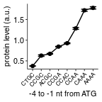

Fluorescence of PGK1 WT reporters with no inserts and varying 5'UTR mutations
================
rasi
30 July, 2019

-   [Import libraries and analysis-specific parameters](#import-libraries-and-analysis-specific-parameters)
-   [Read data](#read-data)
-   [Read annotations](#read-annotations)
-   [Rename and calculate average values of fluorescence channels in each well](#rename-and-calculate-average-values-of-fluorescence-channels-in-each-well)
-   [Calculate mean and standard error over replicates](#calculate-mean-and-standard-error-over-replicates)
-   [Plot background subtracted and normalized YFP/RFP ratio as a function of initiation codon](#plot-background-subtracted-and-normalized-yfprfp-ratio-as-a-function-of-initiation-codon)
-   [Source data for Fig. 1B](#source-data-for-fig.-1b)

Import libraries and analysis-specific parameters
=================================================

``` r
# standard analysis and plotting functions, includes dplyr, ggplot2 
library(tidyverse)
# loads lab default ggplot2 theme and provides color-blind friendly palette
library(rasilabRtemplates)
# standard error
library(plotrix)

# initiation sites are arranged in this order
initiationmutation_order <- seq(1,8)
names(initiationmutation_order) <- toupper(c( 'ctgc', 'ccgc', 
                              'acgc', 'ccga', 'ccac', 'ccaa', 'caaa', 'aaaa'))

# this folder contains the data and annotations
fcs_file_folder <- "../../data/flow/no_insert/"
```

Read data
=========

``` r
flowdata  <- read_tsv(paste0(fcs_file_folder, '/data.tsv.xz')) %>% 
  print()
```

    ## # A tibble: 780,000 x 7
    ##    plate well  FSC.A SSC.A FITC.A PE.Texas.Red.A  Time
    ##    <int> <chr> <int> <int>  <int>          <int> <dbl>
    ##  1     1 B2    65154 32131    145            -30  3.06
    ##  2     1 B2    41616 12409     31             71  3.08
    ##  3     1 B2    18799  5290    -14            -75  3.10
    ##  4     1 B2    27994 10913     50             72  3.11
    ##  5     1 B2    20615  8426    -20            -93  3.13
    ##  6     1 B2    32580  9919     24             36  3.14
    ##  7     1 B2    52503 18276     14             16  3.26
    ##  8     1 B2    19405  7656    -26            -98  3.32
    ##  9     1 B2    19741 11272     37             -5  3.40
    ## 10     1 B2    46243 21834     -5             47  3.41
    ## # ... with 779,990 more rows

Read annotations
================

``` r
annotations  <- read_tsv(paste0(fcs_file_folder, '/annotations.tsv')) %>% 
  print()
```

    ## # A tibble: 78 x 6
    ##    plate well  strain  replicate initiationmutation gene   
    ##    <int> <chr> <chr>       <int> <chr>              <chr>  
    ##  1     1 B2    by4741          1 CAAA               <NA>   
    ##  2     1 B3    schp15          1 CAAA               <NA>   
    ##  3     1 B4    schp19          1 CAAA               maxhis3
    ##  4     1 B5    schp20          1 CAAA               maxhis3
    ##  5     1 D4    schp971         1 CAAA               pgk1   
    ##  6     1 D5    schp972         1 CCGC               pgk1   
    ##  7     1 D6    schp973         1 CCAA               pgk1   
    ##  8     1 D7    schp974         1 CCAC               pgk1   
    ##  9     1 D8    schp975         1 CCGA               pgk1   
    ## 10     1 D9    schp976         1 CTGC               pgk1   
    ## # ... with 68 more rows

Rename and calculate average values of fluorescence channels in each well
=========================================================================

``` r
by_file <- flowdata  %>% 
  # group by each plate and well
  group_by(plate, well) %>% 
  select(FITC.A, PE.Texas.Red.A) %>% 
  # calculate mean
  summarise_all(mean) %>% 
  # rename
  rename('yfp' = FITC.A, 'rfp' = PE.Texas.Red.A) %>% 
  # join annotations
  left_join(annotations, by = c('plate', 'well')) %>% 
  print()
```

    ## # A tibble: 78 x 8
    ## # Groups:   plate [?]
    ##    plate well      yfp     rfp strain  replicate initiationmutation gene   
    ##    <int> <chr>   <dbl>   <dbl> <chr>       <int> <chr>              <chr>  
    ##  1     1 B2       61.9    34.5 by4741          1 CAAA               <NA>   
    ##  2     1 B3      255.  17537.  schp15          1 CAAA               <NA>   
    ##  3     1 B4     2887.  17279.  schp19          1 CAAA               maxhis3
    ##  4     1 B5    22305.  16433.  schp20          1 CAAA               maxhis3
    ##  5     1 D10   43311.  19291.  schp977         1 AAAA               pgk1   
    ##  6     1 D11   16555.  19609.  schp978         1 ACGC               pgk1   
    ##  7     1 D4    42875.  19134.  schp971         1 CAAA               pgk1   
    ##  8     1 D5    15041.  21224.  schp972         1 CCGC               pgk1   
    ##  9     1 D6    27767.  16539.  schp973         1 CCAA               pgk1   
    ## 10     1 D7    21303.  17632.  schp974         1 CCAC               pgk1   
    ## # ... with 68 more rows

Calculate mean and standard error over replicates
=================================================

``` r
avg_data  <- by_file %>% 
  # anti_join(bad_wells) %>% 
  # strain is used to get replicates
  group_by(strain) %>% 
  # calculate mean and std.err
  mutate(mean_yfp = mean(yfp), 
         mean_rfp = mean(rfp)) %>% 
  ungroup() %>% 
  mutate(yfp = yfp - mean_yfp[strain == "schp15" & replicate == 1], 
         rfp = rfp - mean_rfp[strain == "by4741" & replicate == 1]) %>% 
  mutate(yfp_rfp_ratio = yfp / rfp) %>% 
  # calculate mean and standard error
  group_by(strain) %>% 
  mutate(mean_yfp = mean(yfp), 
         mean_rfp = mean(rfp), 
         mean_ratio = mean(yfp_rfp_ratio), 
         se_yfp = std.error(yfp), 
         se_rfp = std.error(rfp),
         se_ratio = std.error(yfp_rfp_ratio),
         n = n()) %>% 
  slice(1) %>% 
  ungroup()

normalization <- avg_data %>% 
  filter(strain == "schp20")
```

Plot background subtracted and normalized YFP/RFP ratio as a function of initiation codon
=========================================================================================

``` r
plot_data <- avg_data %>% 
  mutate(mean_ratio = mean_ratio / normalization[[1, "mean_ratio"]]) %>% 
  mutate(se_ratio = se_ratio / normalization[[1, "mean_ratio"]]) %>% 
  # arrange initiationmutation in this order
  mutate(initiationmutation = fct_reorder(
      initiationmutation,
      initiationmutation_order[initiationmutation])) %>%
  filter(initiationmutation != "CTG") %>%
  filter(gene == "pgk1")

plot_data %>% 
  ggplot(aes(x = initiationmutation, y = mean_ratio, 
             ymin = mean_ratio - se_ratio, ymax = mean_ratio + se_ratio,
             group = NA)) +
  geom_point(size = 1.5) +
  geom_line() +
  geom_errorbar(width = 0.75) +
  labs(y = 'protein level (a.u.)',
       x = '-4 to -1 nt from ATG') +
  theme(legend.title = element_text(size = 8),
        axis.text.x = element_text(angle = 45, hjust = 1, size = 6))
```



``` r
  # scale_y_continuous(trans = "log2",
  #                    limits = c(3, 16),
  #                    breaks = c(2, 4, 8, 16),
  #                    labels = scales::trans_format("log2", scales::math_format(2^.x)))

ggsave("figures/no_insert.pdf")
```

Source data for Fig. 1B
=======================

``` r
plot_data %>% 
  arrange(initiationmutation) %>% 
  select(initiationmutation, mean_ratio, se_ratio, n) %>% 
  mutate_if(is.numeric, funs(round(., 3))) %>% 
  knitr::kable()
```

| initiationmutation |  mean\_ratio|  se\_ratio|    n|
|:-------------------|------------:|----------:|----:|
| CTGC               |        0.376|      0.004|    6|
| CCGC               |        0.627|      0.018|    6|
| ACGC               |        0.670|      0.009|    6|
| CCGA               |        0.844|      0.008|    6|
| CCAC               |        0.926|      0.011|    6|
| CCAA               |        1.285|      0.023|    6|
| CAAA               |        1.722|      0.026|    6|
| AAAA               |        1.780|      0.028|    6|
