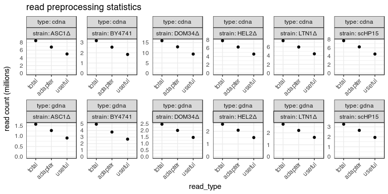
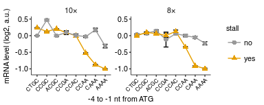
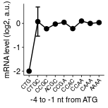

Analyze initiation codon pair mRNA levels
================
rasi
01 January, 2019

-   [Load libraries and define analysis-specific parameters](#load-libraries-and-define-analysis-specific-parameters)
-   [Read barcode and strain annotations](#read-barcode-and-strain-annotations)
-   [Plot read count statistics](#plot-read-count-statistics)
-   [Read count data and join with barcode and strain annotations](#read-count-data-and-join-with-barcode-and-strain-annotations)
-   [Calculate log2 fold mRNA levels median normalized within each initiation set](#calculate-log2-fold-mrna-levels-median-normalized-within-each-initiation-set)
-   [Plot mRNA level of PGK1-YFP with different codons, wild-type cells](#plot-mrna-level-of-pgk1-yfp-with-different-codons-wild-type-cells)
-   [Plot mRNA level of PGK1-YFP, no insert](#plot-mrna-level-of-pgk1-yfp-no-insert)
-   [Plot mRNA levels of KO codon mutants for paper](#plot-mrna-levels-of-ko-codon-mutants-for-paper)

Load libraries and define analysis-specific parameters
======================================================

``` r
library(glue)
library(tidyverse)
library(rasilabRtemplates)

codonnames <- c(
  "AAG" = "10xAAG",
  "AGA" = "10xAGA",
  "CCG" = "8xCCG",
  "CCA" = "8xCCA",
  "AGT" = "PGK1_wt",
  "TCC" = "PGK1_5xAGA5")

initiationmutation_order <- seq(1,9)
names(initiationmutation_order) <- c('CTG', 'CTGC', 'CCGC', 
                              'ACGC', 'CCGA', 'CCAC', 'CCAA', 'CAAA', 'AAAA')
```

Read barcode and strain annotations
===================================

``` r
r2_annotations <- read_tsv("../../data/htseq/r2_barcode_annotations.tsv") %>% 
  print()
```

    ## # A tibble: 12 x 5
    ##    strain_num strain type  barcode primer
    ##    <chr>      <chr>  <chr> <chr>   <chr> 
    ##  1 scHP1124   BY4741 cdna  GCGGAC  oAS121
    ##  2 scHP1125   scHP15 cdna  TTTCAC  oAS122
    ##  3 scHP1126   LTN1Δ  cdna  GGCCAC  oAS123
    ##  4 scHP1127   DOM34Δ cdna  CGAAAC  oAS124
    ##  5 scHP1128   ASC1Δ  cdna  CGTACG  oAS125
    ##  6 scHP1129   HEL2Δ  cdna  CCACTC  oAS126
    ##  7 scHP1124   BY4741 gdna  AAGCTA  oAS129
    ##  8 scHP1125   scHP15 gdna  GTAGCC  oAS130
    ##  9 scHP1126   LTN1Δ  gdna  TACAAG  oAS131
    ## 10 scHP1127   DOM34Δ gdna  TTGACT  oAS132
    ## 11 scHP1128   ASC1Δ  gdna  GGAACT  oAS133
    ## 12 scHP1129   HEL2Δ  gdna  TGACAT  oAS134

``` r
strain_annotations <- read_tsv("../../data/htseq/strain_annotations.tsv") %>% 
  print()
```

    ## # A tibble: 54 x 6
    ##      row plasmid    init  codon  gene  label 
    ##    <int> <chr>      <chr> <chr>  <chr> <chr> 
    ##  1     1 phpsc354-1 CAAA  aagaag pgk1  10×aag
    ##  2     2 phpsc355-1 CCGC  aagaag pgk1  10×aag
    ##  3     3 phpsc356-1 CCAA  aagaag pgk1  10×aag
    ##  4     4 phpsc357-1 CCAC  aagaag pgk1  10×aag
    ##  5     5 phpsc358-1 CCGA  aagaag pgk1  10×aag
    ##  6     6 phpsc359-1 CTGC  aagaag pgk1  10×aag
    ##  7     7 phpsc360-1 AAAA  aagaag pgk1  10×aag
    ##  8     8 phpsc361-1 ACGC  aagaag pgk1  10×aag
    ##  9     9 phpsc362-1 CTG   aagaag pgk1  10×aag
    ## 10    10 phpsc363-1 CAAA  agaaga pgk1  10×aga
    ## # ... with 44 more rows

``` r
barcode_annotations <- read_tsv("../../data/htseq/barcode_annotations.tsv") %>% 
  print()
```

    ## # A tibble: 210 x 4
    ##    plate  well  primer_name      barcode 
    ##    <chr>  <chr> <chr>            <chr>   
    ##  1 plate1 A1    cyc1_rep1_bc1_R  GTTTGTTT
    ##  2 plate1 B1    cyc1_rep1_bc2_R  CCGTGTTT
    ##  3 plate1 C1    cyc1_rep1_bc3_R  TAGTGTTT
    ##  4 plate1 D1    cyc1_rep1_bc4_R  GGCGGTTT
    ##  5 plate1 E1    cyc1_rep1_bc5_R  GATCGTTT
    ##  6 plate1 F1    cyc1_rep1_bc6_R  TCACGTTT
    ##  7 plate1 G1    cyc1_rep1_bc7_R  TGTAGTTT
    ##  8 plate1 H1    cyc1_rep1_bc8_R  CACAGTTT
    ##  9 plate1 A2    cyc1_rep1_bc9_R  CTTTCTTT
    ## 10 plate1 B2    cyc1_rep1_bc10_R GCCTCTTT
    ## # ... with 200 more rows

``` r
strain_barcode_annotations <- read_tsv("../../data/htseq/strain_barcode_annotations.tsv") %>% 
  # get rid of plasmid well and Description, we don't need it
  select(-Description, -well) %>% 
  # combine plate and well location into 1
  mutate(oligo1 = paste0(plate1, "_", well1), 
         oligo2 = paste0(plate2, "_", well2),
         oligo3 = paste0(plate3, "_", well3), 
         oligo4 = paste0(plate4, "_", well4)) %>% 
  # get ride of plate and well columns
  select(-matches("^plate|^well")) %>% 
  # gather all oligos into single well
  gather(oligo, location, -plasmid) %>% 
  # separate again into plate and well
  separate(location, c("plate", "well")) %>% 
  select(-oligo) %>% 
  # clean up A01 to A1, B02 to B2 etc.
  mutate(well = str_replace(well, "([A-Z])0(\\d)", "\\1\\2")) %>% 
  # remove empty wells  
  filter(well != "NA") %>% 
  print()
```

    ## # A tibble: 210 x 3
    ##    plasmid    plate  well 
    ##    <chr>      <chr>  <chr>
    ##  1 phpsc354-1 plate1 A1   
    ##  2 phpsc355-1 plate1 B1   
    ##  3 phpsc356-1 plate1 C1   
    ##  4 phpsc357-1 plate1 D1   
    ##  5 phpsc358-1 plate1 E1   
    ##  6 phpsc359-1 plate1 F1   
    ##  7 phpsc360-1 plate1 G1   
    ##  8 phpsc361-1 plate1 H1   
    ##  9 phpsc363-1 plate1 A2   
    ## 10 phpsc364-1 plate1 B2   
    ## # ... with 200 more rows

Plot read count statistics
==========================

``` r
plot_data <- list.files("tables/", full.names = T, 
                         pattern = "read_counts.tsv") %>% 
  enframe("sno", "file") %>% 
  mutate(data = map(file, data.table::fread)) %>% 
  mutate(barcode = str_extract(file, "[ACTG]{6}")) %>% 
  unnest() %>% 
  rename(read_type = type) %>% 
  select(-sno, -file) %>% 
  left_join(r2_annotations, by = "barcode") %>% 
  mutate(count = count / 1e6) %>% 
  group_by(strain, type) %>% 
  mutate(read_type = fct_reorder(read_type, count, .desc = T)) %>% 
  print()
```

    ## # A tibble: 36 x 7
    ## # Groups:   strain, type [12]
    ##    barcode read_type count strain_num strain type  primer
    ##    <chr>   <fct>     <dbl> <chr>      <chr>  <chr> <chr> 
    ##  1 AAGCTA  total      4.97 scHP1124   BY4741 gdna  oAS129
    ##  2 AAGCTA  adapter    3.78 scHP1124   BY4741 gdna  oAS129
    ##  3 AAGCTA  useful     2.69 scHP1124   BY4741 gdna  oAS129
    ##  4 CCACTC  total      7.78 scHP1129   HEL2Δ  cdna  oAS126
    ##  5 CCACTC  adapter    6.27 scHP1129   HEL2Δ  cdna  oAS126
    ##  6 CCACTC  useful     4.58 scHP1129   HEL2Δ  cdna  oAS126
    ##  7 CGAAAC  total     16.0  scHP1127   DOM34Δ cdna  oAS124
    ##  8 CGAAAC  adapter   12.9  scHP1127   DOM34Δ cdna  oAS124
    ##  9 CGAAAC  useful     9.39 scHP1127   DOM34Δ cdna  oAS124
    ## 10 CGTACG  total      8.49 scHP1128   ASC1Δ  cdna  oAS125
    ## # ... with 26 more rows

``` r
plot_data %>%
  ggplot(aes(x = read_type, y = count)) +
  facet_wrap(~ type + strain, ncol = 6, scales = "free", 
             labeller = label_both) +
  geom_point() +
  theme_bw() +
  theme(axis.text.x = element_text(angle = 45, hjust = 1),
        axis.ticks.y = element_blank()) +
  scale_y_continuous(limits = c(0, NA)) +
  labs(title = "read preprocessing statistics", y = "read count (millions)")
```



``` r
ggsave("figures/read_preprocessing_stats.pdf")
```

Read count data and join with barcode and strain annotations
============================================================

``` r
count_data <- list.files("tables/", pattern = "barcode_counts.tsv",
                         full.names = T) %>% 
  enframe("sno", "file") %>% 
  # extract R2 barcode
  mutate(barcode = str_extract(file, "(?<=/)[ACTG]{6}")) %>% 
  # read data
  mutate(data = map(file, read_tsv)) %>% 
  # expand to a single dataframe
  unnest() %>% 
  # join by R2 barcode
  left_join(r2_annotations, by = "barcode") %>% 
  # keep only columns of interest
  select(-sno, -file, -index, -barcode, -strain_num, -primer) %>%
  rename(barcode = r1_barcode) %>% 
  left_join(barcode_annotations, by = "barcode") %>% 
  # keep only columns of interest
  select(-primer_name) %>% 
  left_join(strain_barcode_annotations, by = c("plate", "well")) %>% 
  # keep only columns of interest
  select(-plate, -well) %>% 
  left_join(strain_annotations, by = "plasmid") %>% 
  # keep only columns of interest
  select(-row) %>% 
  arrange(count) %>%
  print()
```

    ## # A tibble: 2,518 x 9
    ##    count barcode  strain type  plasmid    init  codon  gene  label 
    ##    <int> <chr>    <chr>  <chr> <chr>      <chr> <chr>  <chr> <chr> 
    ##  1     1 TTATAGCC scHP15 gdna  phpsc361-1 ACGC  aagaag pgk1  10×aag
    ##  2     1 AGGCAACG scHP15 gdna  phpsc316-2 CCAA  ccacca pgk1  8×cca 
    ##  3     1 AGGCAACG DOM34Δ gdna  phpsc316-2 CCAA  ccacca pgk1  8×cca 
    ##  4     2 TTATAGCC BY4741 cdna  phpsc361-1 ACGC  aagaag pgk1  10×aag
    ##  5     2 AGGCAACG BY4741 cdna  phpsc316-2 CCAA  ccacca pgk1  8×cca 
    ##  6     2 TTATAGCC LTN1Δ  cdna  phpsc361-1 ACGC  aagaag pgk1  10×aag
    ##  7     2 TTATAGCC LTN1Δ  gdna  phpsc361-1 ACGC  aagaag pgk1  10×aag
    ##  8     3 AGGCAACG BY4741 gdna  phpsc316-2 CCAA  ccacca pgk1  8×cca 
    ##  9     3 TTATAGCC ASC1Δ  cdna  phpsc361-1 ACGC  aagaag pgk1  10×aag
    ## 10     3 AGGCAACG ASC1Δ  gdna  phpsc316-2 CCAA  ccacca pgk1  8×cca 
    ## # ... with 2,508 more rows

Calculate log2 fold mRNA levels median normalized within each initiation set
============================================================================

``` r
lfc_data <- count_data %>% 
  # get rid of low counts
  filter(count >= 100) %>% 
  # spread cdna and gdna counts for each barcode to adjacent columns
  spread(type, count) %>%
  # calculate log2 fold change cdna / gdna
  mutate(lfc = log2(cdna)-log2(gdna)) %>%
  # get rid of NA
  filter(!is.na(lfc)) %>%
  # median normalize each group
  group_by(label, strain, init) %>%
  summarize(mean_lfc = mean(lfc), se_lfc = var(lfc) / sqrt(n() - 1)) %>%
  ungroup() %>%
  group_by(label, strain) %>%
  mutate(mean_lfc = mean_lfc - median(mean_lfc)) %>%
  ungroup() %>%
  # arrange init_mutation in correct_order
  mutate(init = fct_reorder(init, initiationmutation_order[init])) %>%
  print()
```

    ## # A tibble: 324 x 5
    ##    label  strain init  mean_lfc  se_lfc
    ##    <chr>  <chr>  <fct>    <dbl>   <dbl>
    ##  1 10×aag ASC1Δ  AAAA   -0.198  0.0777 
    ##  2 10×aag ASC1Δ  ACGC    0.0668 0.00600
    ##  3 10×aag ASC1Δ  CAAA    0.     0.0123 
    ##  4 10×aag ASC1Δ  CCAA   -0.410  0.0146 
    ##  5 10×aag ASC1Δ  CCAC    0.357  0.0839 
    ##  6 10×aag ASC1Δ  CCGA    0.312  0.0213 
    ##  7 10×aag ASC1Δ  CCGC   -0.0598 0.0398 
    ##  8 10×aag ASC1Δ  CTG    -1.71   0.0168 
    ##  9 10×aag ASC1Δ  CTGC    0.241  0.00870
    ## 10 10×aag BY4741 AAAA   -0.579  0.00278
    ## # ... with 314 more rows

Plot mRNA level of PGK1-YFP with different codons, wild-type cells
==================================================================

``` r
plot_data <- lfc_data %>% 
  filter(strain == "scHP15" & !str_detect(label, "pgk1")) %>% 
  mutate(codon_group = substr(label, 1, nchar(label)-3)) %>% 
  mutate(stall = if_else(str_detect(label, "aag|ccg"), "yes", "no")) 

plot_data %>% 
  # exclude the mutated start codon since this will be shown in previous panel
  filter(init != "CTG") %>% 
  ggplot(aes(x = init, y = mean_lfc, group = label, shape = stall, color = stall)) +
  facet_wrap(~ codon_group, ncol = 2, scales = "free_y") +
  geom_errorbar(aes(ymin = mean_lfc - se_lfc, ymax = mean_lfc + se_lfc),
                width = 0.5, color = "black") +
  geom_line() +
  geom_point(size = 2) +
  scale_color_manual(values = cbPalette) +
  # scale_shape_manual(values = c(21, 24, 22, 25)) +
  theme(axis.text.x = element_text(angle = 45, hjust = 1, size = 6)) +
  scale_y_continuous(limits = c(-1.1, +0.5)) +
  labs(x = "-4 to -1 nt from ATG", y = "mRNA level (log2, a.u.)")
```



``` r
ggsave("figures/mrna_level_wt_4_codons.pdf")
```

Plot mRNA level of PGK1-YFP, no insert
======================================

``` r
plot_data <- lfc_data %>% 
  filter(strain == "scHP15" & str_detect(label, "pgk1, no insert"))

plot_data %>% 
  ggplot(aes(x = init, y = mean_lfc, group = label)) +
  geom_errorbar(aes(ymin = mean_lfc - se_lfc, ymax = mean_lfc + se_lfc),
                width = 0.5, color = "black") +
  geom_line() +
  geom_point(size = 2) +
  scale_color_manual(values = cbPalette) +
  theme(axis.text.x = element_text(angle = 45, hjust = 1, size = 6)) +
  # scale_y_continuous(limits = c(-1.1, +0.5)) +
  labs(x = "-4 to -1 nt from ATG", y = "mRNA level (log2, a.u.)")
```



``` r
ggsave("figures/mrna_level_wt_pgk1_no_insert.pdf")
```

Plot mRNA levels of KO codon mutants for paper
==============================================

``` r
plot_data <- lfc_data %>% 
  filter(str_detect(strain, "Δ") & !str_detect(label, "pgk1")) %>% 
  mutate(codon_group = substr(label, 1, 1)) %>% 
  filter(codon_group == "8") %>% 
  mutate(stall = if_else(str_detect(label, "aag|ccg"), "yes", "no")) %>% 
  mutate(strain = str_replace(strain, "(.+)(.)", "\\2\\1")) %>% 
  mutate(strain = fct_relevel(strain, "ΔLTN1", "ΔDOM34", "ΔHEL2", "ΔASC1"))

plot_data %>% 
  # exclude the mutated start codon since this will be shown in previous panel
  filter(init != "CTG") %>% 
  ggplot(aes(x = init, y = mean_lfc, group = label, shape = stall, color = stall)) +
  facet_wrap(~ strain, ncol = 4, scales = "fixed") +
  geom_errorbar(aes(ymin = mean_lfc - se_lfc, ymax = mean_lfc + se_lfc),
                width = 0.5, color = "black") +
  geom_line() +
  geom_point(size = 2) +
  scale_color_manual(values = cbPalette) +
  # scale_shape_manual(values = c(21, 24, 22, 25)) +
  theme(axis.text.x = element_text(angle = 45, hjust = 1, size = 6)) +
  scale_y_continuous(limits = c(-1.1, +0.5)) +
  labs(x = "-4 to -1 nt from ATG", y = "mRNA level (log2, a.u.)")
```


``` r
ggsave("figures/mrna_level_ko_2_codons.pdf")
```
