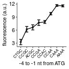

Plot Kozak strength of initiation mutations based on Dvir et al. PNAS 2013
================
rasi
17 July, 2019

-   [Load libraries that we use repeatedly](#load-libraries-that-we-use-repeatedly)
-   [Download the Table S1 from Dvir et al. that has the protein abundance for 2041 sequence variants.](#download-the-table-s1-from-dvir-et-al.-that-has-the-protein-abundance-for-2041-sequence-variants.)
-   [Plot Kozak strength vs Kozak sequence for paper](#plot-kozak-strength-vs-kozak-sequence-for-paper)
-   [Session Info](#session-info)

Load libraries that we use repeatedly
=====================================

``` r
library(tidyverse)
library(plyranges)
library(Biostrings)
library(rasilabRtemplates)
```

Download the Table S1 from Dvir et al. that has the protein abundance for 2041 sequence variants.
=================================================================================================

``` bash
cd ../tables/
wget --no-clobber http://www.pnas.org/lookup/suppl/doi:10.1073/pnas.1222534110/-/DCSupplemental/sd01.xlsx
```

    ## --2019-07-17 17:20:35--  http://www.pnas.org/lookup/suppl/doi:10.1073/pnas.1222534110/-/DCSupplemental/sd01.xlsx
    ## Resolving www.pnas.org (www.pnas.org)... 104.16.153.14, 104.16.154.14, 104.16.152.14, ...
    ## Connecting to www.pnas.org (www.pnas.org)|104.16.153.14|:80... connected.
    ## HTTP request sent, awaiting response... 301 Moved Permanently
    ## Location: https://www.pnas.org/lookup/suppl/doi:10.1073/pnas.1222534110/-/DCSupplemental/sd01.xlsx [following]
    ## --2019-07-17 17:20:35--  https://www.pnas.org/lookup/suppl/doi:10.1073/pnas.1222534110/-/DCSupplemental/sd01.xlsx
    ## Connecting to www.pnas.org (www.pnas.org)|104.16.153.14|:443... connected.
    ## HTTP request sent, awaiting response... 301 Moved Permanently
    ## Location: https://www.pnas.org/highwire/filestream/613140/field_highwire_adjunct_files/1/sd01.xlsx [following]
    ## --2019-07-17 17:20:35--  https://www.pnas.org/highwire/filestream/613140/field_highwire_adjunct_files/1/sd01.xlsx
    ## Reusing existing connection to www.pnas.org:443.
    ## HTTP request sent, awaiting response... 302 Found
    ## Location: https://www.pnas.org/content/pnas/suppl/2013/07/05/1222534110.DCSupplemental/sd01.xlsx [following]
    ## --2019-07-17 17:20:35--  https://www.pnas.org/content/pnas/suppl/2013/07/05/1222534110.DCSupplemental/sd01.xlsx
    ## Reusing existing connection to www.pnas.org:443.
    ## HTTP request sent, awaiting response... 200 OK
    ## Length: unspecified [application/vnd.openxmlformats-officedocument.spreadsheetml.sheet]
    ## Saving to: ‘sd01.xlsx’
    ## 
    ##      0K .......... .......... .......... .......... .......... 20.8M
    ##     50K .......... .......... .......... ........              3.47M=0.01s
    ## 
    ## 2019-07-17 17:20:36 (6.53 MB/s) - ‘sd01.xlsx’ saved [91068]

Read the data from Dvir et al.

``` r
dvir_data <- readxl::read_excel("../tables/sd01.xlsx") %>% 
  print()
```

    ## # A tibble: 2,041 x 3
    ##    sequence_variant mean_protein_abundance total_reads
    ##    <chr>                             <dbl>       <dbl>
    ##  1 CCGACCCGTT                         9.73        1215
    ##  2 AATCTACGTT                        11.7          398
    ##  3 ATCGGAAGTT                        11.5          190
    ##  4 TTCCAGCCTT                         3.86         332
    ##  5 CTTACACCTT                         2.52        2241
    ##  6 AAAAAACCTT                         7.84        3278
    ##  7 ACGATCACTT                         8.19         935
    ##  8 ATCATCACTT                         7.35         610
    ##  9 CGACCATATT                         7.43         864
    ## 10 AAAATCCATT                        11.7         1453
    ## # ... with 2,031 more rows

The `sequence_variant` column has the 10 nt preceding the start codon. Average protein abundance over all positions except the last 4 nt. Then arrange from highest to lowest expression.

``` r
dvir_data <- dvir_data %>% 
  mutate(kozak = str_extract(sequence_variant, "\\w{4}$")) %>% 
  group_by(kozak) %>% 
  summarize(exp = mean(mean_protein_abundance), 
            se_exp = sd(mean_protein_abundance)/ sqrt(dplyr::n() - 1)) %>% 
  arrange(desc(exp)) %>% 
  print()
```

    ## # A tibble: 211 x 3
    ##    kozak   exp  se_exp
    ##    <chr> <dbl>   <dbl>
    ##  1 TATA   12.5  0.0972
    ##  2 CAAA   11.7  0.213 
    ##  3 CGAA   11.6  0.282 
    ##  4 GAAA   11.6  0.318 
    ##  5 AAAA   11.6  0.235 
    ##  6 AGAA   11.6  0.162 
    ##  7 AGTT   11.5 NA     
    ##  8 TAAA   11.4  0.551 
    ##  9 CATA   11.4  0.344 
    ## 10 AAAT   11.4  0.293 
    ## # ... with 201 more rows

Plot Kozak strength vs Kozak sequence for paper
===============================================

``` r
# intiiation sites are arranged in this order
initiationmutation_order <- seq(1,8)
names(initiationmutation_order) <- toupper(c( 'ctgc', 'ccgc', 
                              'acgc', 'ccga', 'ccac', 'ccaa', 'caaa', 'aaaa'))
dvir_data %>% 
  filter(kozak %in% names(initiationmutation_order)) %>% 
  mutate(kozak = fct_relevel(kozak, names(initiationmutation_order))) %>% 
  ggplot(aes(x = kozak, y = exp, 
             ymin = exp - se_exp, ymax = exp + se_exp, group = NA)) +
  geom_point(size = 1, height = 0, width = 0.1, alpha = 0.5) +
  geom_line() +
  geom_errorbar(width = 0.5) +
  labs(y = 'fluorescence (a.u.)',
       x = '-4 to -1 nt from ATG') +
  theme(legend.title = element_text(size = 8),
        axis.text.x = element_text(angle = 45, hjust = 1, size = 6)) +
  scale_y_continuous(breaks = seq(3,15, 3))
```



``` r
ggsave("../figures/kozak_mutations_compare_dvir.pdf")
```

Session Info
============

``` r
sessionInfo()
```

    ## R version 3.5.1 (2018-07-02)
    ## Platform: x86_64-pc-linux-gnu (64-bit)
    ## Running under: Ubuntu 18.04.1 LTS
    ## 
    ## Matrix products: default
    ## BLAS: /home/rasi/lib/R-3.5.1/lib/R/lib/libRblas.so
    ## LAPACK: /home/rasi/lib/R-3.5.1/lib/R/lib/libRlapack.so
    ## 
    ## locale:
    ##  [1] LC_CTYPE=en_US.UTF-8       LC_NUMERIC=C              
    ##  [3] LC_TIME=en_US.UTF-8        LC_COLLATE=en_US.UTF-8    
    ##  [5] LC_MONETARY=en_US.UTF-8    LC_MESSAGES=en_US.UTF-8   
    ##  [7] LC_PAPER=en_US.UTF-8       LC_NAME=C                 
    ##  [9] LC_ADDRESS=C               LC_TELEPHONE=C            
    ## [11] LC_MEASUREMENT=en_US.UTF-8 LC_IDENTIFICATION=C       
    ## 
    ## attached base packages:
    ## [1] stats4    parallel  stats     graphics  grDevices datasets  utils    
    ## [8] methods   base     
    ## 
    ## other attached packages:
    ##  [1] bindrcpp_0.2.2          rasilabRtemplates_0.1.0
    ##  [3] Biostrings_2.48.0       XVector_0.20.0         
    ##  [5] plyranges_1.0.3         GenomicRanges_1.32.6   
    ##  [7] GenomeInfoDb_1.16.0     IRanges_2.14.10        
    ##  [9] S4Vectors_0.18.3        BiocGenerics_0.26.0    
    ## [11] forcats_0.3.0           stringr_1.3.1          
    ## [13] dplyr_0.7.6             purrr_0.2.5            
    ## [15] readr_1.1.1             tidyr_0.8.1            
    ## [17] tibble_1.4.2            ggplot2_3.0.0          
    ## [19] tidyverse_1.2.1        
    ## 
    ## loaded via a namespace (and not attached):
    ##  [1] Biobase_2.40.0              httr_1.3.1                 
    ##  [3] jsonlite_1.5                modelr_0.1.2               
    ##  [5] assertthat_0.2.0            GenomeInfoDbData_1.1.0     
    ##  [7] cellranger_1.1.0            Rsamtools_1.32.2           
    ##  [9] yaml_2.2.0                  pillar_1.3.0               
    ## [11] backports_1.1.2             lattice_0.20-35            
    ## [13] glue_1.3.0                  digest_0.6.15              
    ## [15] rvest_0.3.2                 colorspace_1.3-2           
    ## [17] htmltools_0.3.6             Matrix_1.2-14              
    ## [19] plyr_1.8.4                  XML_3.98-1.12              
    ## [21] pkgconfig_2.0.1             broom_0.5.0                
    ## [23] haven_1.1.2                 zlibbioc_1.26.0            
    ## [25] scales_0.5.0                BiocParallel_1.14.2        
    ## [27] withr_2.1.2                 SummarizedExperiment_1.10.1
    ## [29] lazyeval_0.2.1              cli_1.0.0                  
    ## [31] magrittr_1.5                crayon_1.3.4               
    ## [33] readxl_1.1.0                evaluate_0.11              
    ## [35] fansi_0.2.3                 nlme_3.1-137               
    ## [37] xml2_1.2.0                  tools_3.5.1                
    ## [39] hms_0.4.2                   matrixStats_0.54.0         
    ## [41] munsell_0.5.0               DelayedArray_0.6.2         
    ## [43] compiler_3.5.1              rlang_0.2.1                
    ## [45] grid_3.5.1                  RCurl_1.95-4.11            
    ## [47] rstudioapi_0.7              bitops_1.0-6               
    ## [49] rmarkdown_1.10              gtable_0.2.0               
    ## [51] R6_2.2.2                    GenomicAlignments_1.16.0   
    ## [53] lubridate_1.7.4             knitr_1.20                 
    ## [55] rtracklayer_1.40.3          utf8_1.1.4                 
    ## [57] bindr_0.1.1                 rprojroot_1.3-2            
    ## [59] stringi_1.2.4               Rcpp_0.12.18               
    ## [61] tidyselect_0.2.4
