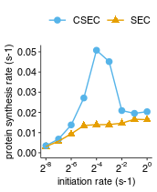
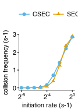
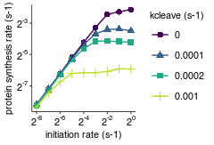

Analyze simulation results
================
rasi
01 January, 2019

-   [Load libraries](#load-libraries)
-   [Read protein count data](#read-protein-count-data)
-   [Read mRNA lifetime data](#read-mrna-lifetime-data)
-   [Read mRNA lifetime data](#read-mrna-lifetime-data-1)
-   [Read simulation parameters](#read-simulation-parameters)
-   [Combine all data into a single table](#combine-all-data-into-a-single-table)
-   [mRNA lifetime as a function of initiation rate](#mrna-lifetime-as-a-function-of-initiation-rate)
-   [PSR as a function of initiation rate](#psr-as-a-function-of-initiation-rate)
-   [Collision rate as a function of initiation rate](#collision-rate-as-a-function-of-initiation-rate)
-   [Same as above but with log Y-scale](#same-as-above-but-with-log-y-scale)
-   [PSR as a function of initiation rate for different cleavage rates in SEC model](#psr-as-a-function-of-initiation-rate-for-different-cleavage-rates-in-sec-model)

Load libraries
--------------

``` r
library(tidyverse)
library(rasilabRtemplates)
# disable scientific notation
options(scipen=999)

cleave_model_names <- c(
  "hit5" = "CSEC",
  "simple" = "SEC",
  "trafficjam" = "TJ"
)
```

Read protein count data
=======================

``` r
psr_data <- read_tsv("tables/psr_stats.tsv") %>% 
  print()
```

    ## # A tibble: 270 x 6
    ##    sim_id mean_p_per_m sd_p_per_m total_p total_time     psr
    ##     <int>        <int>      <int>   <int>      <int>   <dbl>
    ##  1      0            3          2    3333     999764 0.00333
    ##  2      1            3          2    3298     999793 0.00330
    ##  3     10            3          2    3409     999929 0.00341
    ##  4    100           26         13   27414     999976 0.0274 
    ##  5    101           25         13   25862     999997 0.0259 
    ##  6    102           23         13   24638     995388 0.0248 
    ##  7    103           12         10   13504     999411 0.0135 
    ##  8    104            3          2    3239     997123 0.00325
    ##  9    105           26         13   27416     999966 0.0274 
    ## 10    106           26         13   26896     999998 0.0269 
    ## # ... with 260 more rows

Read mRNA lifetime data
=======================

``` r
lifetime_data <- read_tsv("tables/mrna_lifetime_stats.tsv") %>% 
  mutate(se_lifetime = sd_lifetime / sqrt(n_mrna)) %>% 
  print()
```

    ## # A tibble: 270 x 5
    ##    sim_id mean_lifetime sd_lifetime n_mrna se_lifetime
    ##     <int>         <int>       <int>  <int>       <dbl>
    ##  1      0          2104         277   1004        8.74
    ##  2      1          2069         347    973       11.1 
    ##  3     10          2105         269   1043        8.33
    ##  4    100          2096         275   1019        8.61
    ##  5    101          1874         568    999       18.0 
    ##  6    102          1738         670   1063       20.5 
    ##  7    103           700         605   1051       18.7 
    ##  8    104           152         128    962        4.13
    ##  9    105          2080         281   1026        8.77
    ## 10    106          2105         294   1001        9.29
    ## # ... with 260 more rows

Read mRNA lifetime data
=======================

``` r
collision_data <- read_tsv("tables/collision_stats.tsv") %>% 
  print()
```

    ## # A tibble: 270 x 6
    ##    sim_id mean_p_per_m sd_p_per_m total_collision total_time
    ##     <int>        <int>      <int>           <int>      <int>
    ##  1      0            8          9            1855     999764
    ##  2      1            7          7            1701     999793
    ##  3     10            6          7             474     999203
    ##  4    100           35         42           31140     999976
    ##  5    101           37         42           31755     999997
    ##  6    102           35         42           31058     995388
    ##  7    103           29         31           23034     999411
    ##  8    104           13         14            6282     995477
    ##  9    105           37         44           32709     999966
    ## 10    106           35         40           30169     999998
    ## # ... with 260 more rows, and 1 more variable: collision_freq <dbl>

Read simulation parameters
==========================

``` r
sim_params <- read_tsv("sim.params.tsv") %>% 
  rename(sim_id = X1) %>% 
  mutate(k_elong_stall = str_split(k_elong_stall, ",")) %>%
  mutate(k_elong_stall = map(k_elong_stall, as.numeric)) %>%
  mutate(k_elong_stall = map(k_elong_stall, function(x) unique(x))) %>%
  unnest() %>%
  mutate(x_stall = stringr::str_split(x_stall, ',')) %>%
  mutate(k_stall = round(k_elong_stall / as.numeric(n_stall), 2)) %>%
  select(sim_id, cleave_rate, cleave_model, k_stall) %>%
  print()
```

    ## # A tibble: 270 x 4
    ##    sim_id cleave_rate cleave_model k_stall
    ##     <int>       <dbl> <chr>          <dbl>
    ##  1      0    0.       simple        0.0200
    ##  2      1    0.000100 simple        0.0200
    ##  3      2    0.000200 simple        0.0200
    ##  4      3    0.00100  simple        0.0200
    ##  5      4    0.00500  simple        0.0200
    ##  6      5    0.000100 hit5          0.0200
    ##  7      6    0.000200 hit5          0.0200
    ##  8      7    0.00100  hit5          0.0200
    ##  9      8    0.00500  hit5          0.0200
    ## 10      9    0.0100   hit5          0.0200
    ## # ... with 260 more rows

``` r
annotations <- list.files("output/", pattern = "params.tsv.gz$", full.names = T) %>%
  enframe("sno", "file") %>%
  mutate(sim_id = str_extract(file, "(?<=tasep_)[[:digit:]]+")) %>%
  mutate(data = map(file, read_tsv)) %>%
  select(-file, -sno) %>%
  unnest() %>%
  type_convert() %>%
  # retain only parameters that are varied, the others are for checking
  group_by(parameter) %>%
  mutate(vary = if_else(length(unique(value)) > 1, T, F)) %>%
  ungroup() %>%
  filter(vary == T) %>%
  select(-vary) %>%
  spread(parameter, value) %>%
  left_join(sim_params, by = "sim_id") %>%
  print()
```

    ## # A tibble: 270 x 14
    ##    sim_id k_cleave_5_hit k_cleave_both_hit k_cleave_no_hit k_elong_stall_1
    ##     <int>          <dbl>             <dbl>           <dbl>           <dbl>
    ##  1      0       0.                0.              0.                 0.120
    ##  2      1       0.000100          0.              0.000100           0.120
    ##  3      2       0.000200          0.              0.000200           0.120
    ##  4      3       0.00100           0.              0.00100            0.120
    ##  5      4       0.00500           0.              0.00500            0.120
    ##  6      5       0.000100          0.000100        0.                 0.120
    ##  7      6       0.000200          0.000200        0.                 0.120
    ##  8      7       0.00100           0.00100         0.                 0.120
    ##  9      8       0.00500           0.00500         0.                 0.120
    ## 10      9       0.0100            0.0100          0.                 0.120
    ## # ... with 260 more rows, and 9 more variables: k_elong_stall_2 <dbl>,
    ## #   k_elong_stall_3 <dbl>, k_elong_stall_4 <dbl>, k_elong_stall_5 <dbl>,
    ## #   k_elong_stall_6 <dbl>, k_init <dbl>, cleave_rate <dbl>,
    ## #   cleave_model <chr>, k_stall <dbl>

Combine all data into a single table
====================================

``` r
data <- annotations %>% 
  left_join(psr_data, by = "sim_id") %>% 
  left_join(lifetime_data, by = "sim_id") %>% 
  left_join(collision_data, by = "sim_id") %>% 
  print()
```

    ## # A tibble: 270 x 28
    ##    sim_id k_cleave_5_hit k_cleave_both_hit k_cleave_no_hit k_elong_stall_1
    ##     <int>          <dbl>             <dbl>           <dbl>           <dbl>
    ##  1      0       0.                0.              0.                 0.120
    ##  2      1       0.000100          0.              0.000100           0.120
    ##  3      2       0.000200          0.              0.000200           0.120
    ##  4      3       0.00100           0.              0.00100            0.120
    ##  5      4       0.00500           0.              0.00500            0.120
    ##  6      5       0.000100          0.000100        0.                 0.120
    ##  7      6       0.000200          0.000200        0.                 0.120
    ##  8      7       0.00100           0.00100         0.                 0.120
    ##  9      8       0.00500           0.00500         0.                 0.120
    ## 10      9       0.0100            0.0100          0.                 0.120
    ## # ... with 260 more rows, and 23 more variables: k_elong_stall_2 <dbl>,
    ## #   k_elong_stall_3 <dbl>, k_elong_stall_4 <dbl>, k_elong_stall_5 <dbl>,
    ## #   k_elong_stall_6 <dbl>, k_init <dbl>, cleave_rate <dbl>,
    ## #   cleave_model <chr>, k_stall <dbl>, mean_p_per_m.x <int>,
    ## #   sd_p_per_m.x <int>, total_p <int>, total_time.x <int>, psr <dbl>,
    ## #   mean_lifetime <int>, sd_lifetime <int>, n_mrna <int>,
    ## #   se_lifetime <dbl>, mean_p_per_m.y <int>, sd_p_per_m.y <int>,
    ## #   total_collision <int>, total_time.y <int>, collision_freq <dbl>

mRNA lifetime as a function of initiation rate
==============================================

``` r
plot_data <- data %>% 
  filter(cleave_rate == 0.001 & k_stall == 0.1) %>%
  mutate(model = cleave_model_names[cleave_model]) %>%
  print()
```

    ## # A tibble: 18 x 29
    ##    sim_id k_cleave_5_hit k_cleave_both_hit k_cleave_no_hit k_elong_stall_1
    ##     <int>          <dbl>             <dbl>           <dbl>           <dbl>
    ##  1     13        0.00100           0.              0.00100           0.600
    ##  2     17        0.00100           0.00100         0.                0.600
    ##  3     43        0.00100           0.              0.00100           0.600
    ##  4     47        0.00100           0.00100         0.                0.600
    ##  5     73        0.00100           0.              0.00100           0.600
    ##  6     77        0.00100           0.00100         0.                0.600
    ##  7    103        0.00100           0.              0.00100           0.600
    ##  8    107        0.00100           0.00100         0.                0.600
    ##  9    133        0.00100           0.              0.00100           0.600
    ## 10    137        0.00100           0.00100         0.                0.600
    ## 11    163        0.00100           0.              0.00100           0.600
    ## 12    167        0.00100           0.00100         0.                0.600
    ## 13    193        0.00100           0.              0.00100           0.600
    ## 14    197        0.00100           0.00100         0.                0.600
    ## 15    223        0.00100           0.              0.00100           0.600
    ## 16    227        0.00100           0.00100         0.                0.600
    ## 17    253        0.00100           0.              0.00100           0.600
    ## 18    257        0.00100           0.00100         0.                0.600
    ## # ... with 24 more variables: k_elong_stall_2 <dbl>,
    ## #   k_elong_stall_3 <dbl>, k_elong_stall_4 <dbl>, k_elong_stall_5 <dbl>,
    ## #   k_elong_stall_6 <dbl>, k_init <dbl>, cleave_rate <dbl>,
    ## #   cleave_model <chr>, k_stall <dbl>, mean_p_per_m.x <int>,
    ## #   sd_p_per_m.x <int>, total_p <int>, total_time.x <int>, psr <dbl>,
    ## #   mean_lifetime <int>, sd_lifetime <int>, n_mrna <int>,
    ## #   se_lifetime <dbl>, mean_p_per_m.y <int>, sd_p_per_m.y <int>,
    ## #   total_collision <int>, total_time.y <int>, collision_freq <dbl>,
    ## #   model <chr>

``` r
plot_data %>%
  ggplot(aes(x = k_init, y = mean_lifetime, color = model, shape = model)) +
  geom_point(size = 2) +
  geom_line() +
  scale_x_continuous(trans = "log2",
                     labels = scales::trans_format("log2", scales::math_format(2^.x)),
                     breaks = 2^(seq(-8,0,2))) +
  scale_color_manual(values = cbPalette[c(3,2)]) +
  scale_shape_manual(values = c(19, 17)) +
  labs(x = "initiation rate (s-1)", y = "mean mRNA lifetime (s)", color = "", shape = "") +
  theme(legend.position = "top")
```


``` r
ggsave("figures/mrna_lifetime_vs_initiation_rate.pdf", width = 1.7, height = 2)
```

PSR as a function of initiation rate
====================================

``` r
plot_data <- data %>% 
  filter(cleave_rate == 0.001 & k_stall == 0.1) %>% 
  mutate(model = cleave_model_names[cleave_model]) 

plot_data %>%
  ggplot(aes(x = k_init, y = psr, color = model, shape = model)) +
  geom_point(size = 2) +
  geom_line() +
  scale_x_continuous(trans = "log2",
                     labels = scales::trans_format("log2", scales::math_format(2^.x)),
                     breaks = 2^(seq(-8,0,2))) +
  scale_y_continuous(limits = c(0, NA)) +
  scale_color_manual(values = cbPalette[c(3,2)]) +
  scale_shape_manual(values = c(19,17)) +
  labs(x = "initiation rate (s-1)", y = "protein synthesis rate (s-1)", color = "", shape = "") +
  theme(legend.position = "top")
```



``` r
ggsave("figures/psr_vs_initiation_rate.pdf", width = 1.6, height = 2)
```

Collision rate as a function of initiation rate
===============================================

``` r
plot_data <- data %>% 
  filter(cleave_rate == 0.001 & k_stall == 0.1) %>% 
  mutate(model = cleave_model_names[cleave_model]) 

plot_data %>%
  ggplot(aes(x = k_init, y = collision_freq, color = model, shape = model)) +
  geom_point(size = 1.5) +
  geom_line() +
  scale_x_continuous(trans = "log2",
                     labels = scales::trans_format("log2", scales::math_format(2^.x)),
                     breaks = 2^(seq(-8,0,4))) +
  # scale_y_continuous(trans = "log2",
  #                    labels = scales::trans_format("log2", scales::math_format(2^.x))) +
  scale_color_manual(values = cbPalette[c(3,2,1)]) +
  scale_shape_manual(values = c(19, 17,  16)) +
  labs(x = "initiation rate (s-1)", y = "collision frequency (s-1)", color = "", shape = "") +
  theme(legend.position = "top")
```



``` r
ggsave("figures/collision_rate_vs_initiation_rate.pdf")
```

Same as above but with log Y-scale
==================================

``` r
plot_data <- data %>% 
  filter(cleave_rate == 0.001 & k_stall == 0.1) %>% 
  mutate(model = cleave_model_names[cleave_model]) 

plot_data %>%
  ggplot(aes(x = k_init, y = collision_freq, color = model, shape = model)) +
  geom_point(size = 1, show.legend = F) +
  geom_line(show.legend = F) +
  theme(axis.text = element_text(size = 6)) +
  scale_x_continuous(trans = "log2",
                     labels = scales::trans_format("log2", scales::math_format(2^.x)),
                     breaks = 2^(seq(-8,0,4))) +
  scale_y_continuous(trans = "log2",
                     labels = scales::trans_format("log2", scales::math_format(2^.x))) +
  scale_color_manual(values = cbPalette[c(3,2,1)]) +
  scale_shape_manual(values = c(19, 17,  16)) +
  labs(x = "", y = "", color = "", shape = "") +

ggsave("figures/collision_rate_vs_initiation_rate_log_scale.pdf", width=0.8, height=0.8)
```


PSR as a function of initiation rate for different cleavage rates in SEC model
==============================================================================

``` r
plot_data <- data %>% 
  filter(k_stall == 0.1 & cleave_rate <= 0.001) %>% 
  filter(cleave_model == "simple")

plot_data %>%
  ggplot(aes(x = k_init, y = psr, color = as.factor(cleave_rate), shape = as.factor(cleave_rate))) +
  geom_point(size = 2) +
  geom_line() +
  scale_x_continuous(trans = "log2",
                     labels = scales::trans_format("log2", scales::math_format(2^.x)),
                     breaks = 2^(seq(-8,0,2))) +
  scale_y_continuous(trans = "log2",
                     labels = scales::trans_format("log2", scales::math_format(2^.x))) +
  viridis::scale_color_viridis(discrete = T, end = 0.9) +
  labs(x = "initiation rate (s-1)", y = "protein synthesis rate (s-1)", 
       color = "kcleave (s-1)", shape = "kcleave (s-1)") +

ggsave("figures/psr_vs_initiation_rate_vary_cleave_rate.pdf", 
       width = 2.5, height = 1.7)
```


